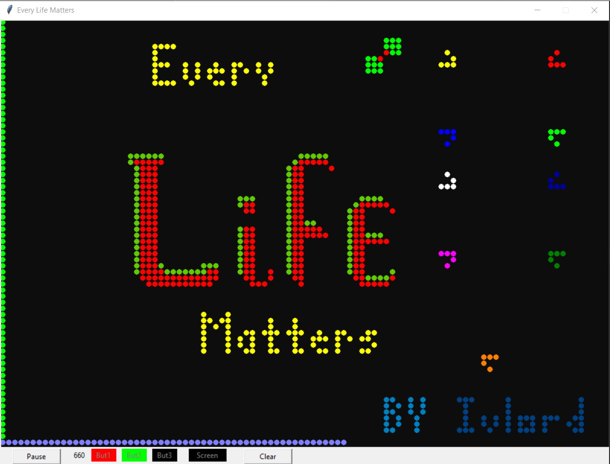

<h1>Симулятор жизни (Life)</h1> 
<h4>
&nbsp;&nbsp;&nbsp;&nbsp;<b>Игра «Жизнь»</b> — клеточный автомат, придуманный английским математиком Джоном Конвеем в 1970 году. 
Каждая клетка поля может находиться в двух состояниях: живой или мёртвой. Клетку окружает 8 соседей. 
Каждый ход колония клеток изменяется по следующим правилам:
<ul>
<li><b>Живой</b> остаётся клетка у которой 2 или 3 соседа</li>
<li><b>Умирает</b> клетка, если у неё 1 или более 3 соседей (от перенаселения)</li>
<li><b>Зарождается</b> жизнь в клетке, у которой ровно 3 соседа</li>
</ul>
Более подробно почитать про игру можно <a href="https://textarchive.ru/c-2586159-pall.html">тут</a>.

&nbsp;&nbsp;&nbsp;&nbsp;Я решил пересоздать игру Life и разнообразил её цветовую гамму. 
При рождении новый цвет клетки вычисляется как средне-арифметическое значение цвета трёх её содедей. Такой подход более наглядно
показывает направление развития процессов. 

 
В симуляторе реализованы такие функции: 
<ul>
<li>возможность поставить на паузу изменение колонии</li>
<li>изменение скорости симуляции скролом мышки</li>
<li>встроенный редактор поля (работает даже в процессе развития колонии)</li>
	<ul>
	<li>добавление клеток и настраиваемые цвета редактирования для левой и средней кнопки мышки</li>
	<li>удаление клеток правой кнопкой мышки</li>
	<li>изменяемый цвет поля</li>
</ul>
</ul>
 
<b>Примечание 1:</b> Файл elm.bin содержит стартовый экран симулятора и явлется необходимым для запуска. 
<b>Примечание 2:</b> Политический подтекст заставки демонстрирует мою личную позицию по данному вопросу. 
</h4>
 
<h2>Планы по изменению:</h2><h4>
<ul>
<li>Добавить возможность сохранения и загрузки "слепка" состояния колонии (готовность 80%)</li>
<li>Подобрать и интегрировать красивую музыку</li>
<li>Добавить дополнительные режимы смешения цветов</li>
<ul>
<li>Цвет берется как случайный из трех соседей</li>
<li>Цвет берется от доминирующих по цвету соседей, вытесняя редкие цвета</li>
<li></li>
</ul>
</ul>
</h4>
<h2>Вывод:</h2><h4>
&nbsp;&nbsp;&nbsp;&nbsp;Основной целью данной работы являлось изучение: ОПП, бинарной записи и чтения данных из файла и дополнительная практика по созданию приложений на Python с интерфейсом в tkinter. 
&nbsp;&nbsp;&nbsp;&nbsp;Все поставленные цели достигнуты, остались небольшие доработки.
</h4>
