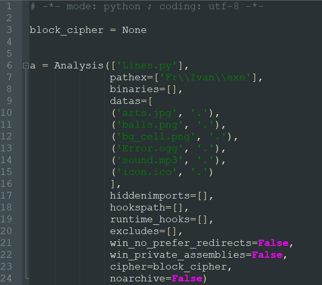
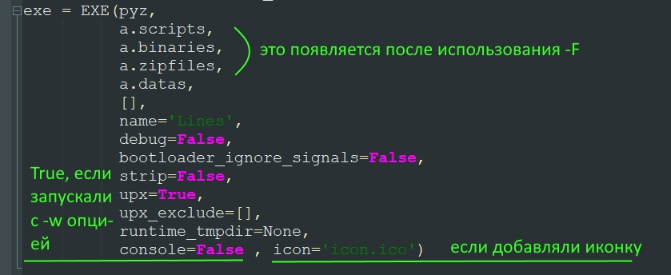
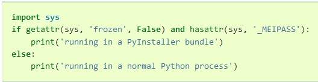

## Программирование
​Автор: Мазлов Иван
​<br><h3> Второй семестр </h3>
<p align="center">МИНИСТЕРСТВО НАУКИ  И ВЫСШЕГО ОБРАЗОВАНИЯ РОССИЙСКОЙ ФЕДЕРАЦИИ<br>
Федеральное государственное автономное образовательное учреждение высшего образования<br>
"КРЫМСКИЙ ФЕДЕРАЛЬНЫЙ УНИВЕРСИТЕТ им. В. И. ВЕРНАДСКОГО"<br>
ФИЗИКО-ТЕХНИЧЕСКИЙ ИНСТИТУТ<br>
Кафедра компьютерной инженерии и моделирования</p>
<br>
<h3 align="center">Отчёт о практическом исследовании <br>"Создание запускного файла<br>из Пайтон-скрипта с включением всех ресурсов" <br> по дисциплине "Программирование"</h3>
<br><br>
<p>студента 1 курса группы ИВТ-б-о-201(2)<br>
Мазлова Ивана Денисовича<br>
направления подготовки 09.03.01 "Информатика и вычислительная техника"</p>
<br><br>
<table>
<tr><td>Научный руководитель:<br> Старший преподаватель Кафедры<br> компьютерной инженерии и моделирования</td>
<td>(&nbsp;&nbsp;&nbsp;&nbsp;&nbsp;&nbsp;&nbsp;&nbsp;&nbsp;&nbsp;&nbsp;&nbsp;&nbsp;&nbsp;&nbsp;&nbsp;&nbsp;&nbsp;&nbsp;&nbsp;&nbsp;&nbsp;&nbsp;&nbsp;&nbsp;&nbsp;&nbsp;&nbsp;&nbsp;&nbsp;&nbsp;&nbsp;)</td>
<td>Чабанов В.В.</td>
</tr>
</table>
<br><br>
<p align="center" > Симферополь, 2021</p>
<hr>

<br><br>
<h1><p align="center">Создание запускного файла<br>из Пайтон-скрипта с включением всех ресурсов,<br>используемых в Python-приложении <br>(графика, звук, шрифты и т.п.)</p><h1>

<h2>Pyinstaller и зачем это всё нужно?</h2><p><a href="#solution">Сразу перейти к решению</a></p>
<h4>
Pyinstaller - специальное приложение, которое входит в состав стандартных библиотек Python и может быть установлено при помощи pip:<br><br>
pip install pyinstaller<br><br>

&nbsp;&nbsp;&nbsp;&nbsp;Это приложение используется для сборки пакета окружения Python вместе с интерпретатором, самого запуского PY-скрипта и всех 
используемых в нём ресурсов в один EXE-файл.<br>
&nbsp;&nbsp;&nbsp;&nbsp;Считается, что так делать не совсем правильно, и многие из тех, кто пишет на Python, никогда не сталкивались с такой необходимостью.<br>
&nbsp;&nbsp;&nbsp;&nbsp;Однако в некоторых ситуациях такой вариант достаточно удобен по нескольким причинам:
<ul><li>конечному пользователю нет необходимости устанавливать Python и все необходимые для работы скрипта библиотеки - он может даже и 
не узнать, что всё работает на Python;</li>
<li>можно продемонстрировать работу своей программы, НЕ передавая сам её код и дополнительные файлы (графики, например);</li>
<li>все файлы пакета собраны в одном файле (компактно, исключена "потеря" отдельных файлов ресурсов);</li>
<li>приложение выглядит как завершенный продукт.</li>
</ul>

В свою очередь, при сборке и использовании появляются и проблемные моменты:
<ul><li>Собрать пакет в один файл без детального понимания, как это сделать, не очень просто (можно легко получить EXE-файл, но вот ресурсные файлы 
всё равно останутся за пределами EXE и скрипт будет работать, только если все ресурсы перенести в папку с EXE).</li>
<li>Размер EXE всегда намного больше, чем сами исходники, так как к нему добавляется ещё и весь пакет окружения Python со всеми библиотеками.</li>
<li>Скорость работы из такого виртуального окружения несколько ниже, чем если запускать просто PY-файл при установленном на компьютере Python.</li>
</ul>
<br>

<h2>Pyinstaller предлагает доработать процесс сборки напильником, или <br>В чём проблема и как с ней бороться?</h2>
&nbsp;&nbsp;&nbsp;&nbsp;Собственно сама сборка пакета представляет собой обычное присоединение к EXE (в НЕархивированной форме) всех ресурсов. 
После запуска EXE-файла запускной кусок кода Pyinstaller запрашивает у операционной системы путь к временной папке
(как правило, это C:\Users\Имя_пользователя\AppData\Local\Temp), создаёт там свою папку со случайным
названием по маске _MEI******, где * - это случайная цифра, и просто копирует туда всё содержимое присоединённых к EXE ресурсов. Вроде бы всё хорошо, но не всё так просто.
<br>
<h2>Сборка. Описание проблемы добавления файлов в EXE</h2>
&nbsp;&nbsp;&nbsp;&nbsp;При неправильном использовании сборка осуществляется командой: <br>pyinstaller name.py.<br>
И всё действительно работает для простых скриптов, которые не используют внешние ресурсы, такие как графика, звук, шрифты, какие-то базы 
данных и прочее.<br>
&nbsp;&nbsp;&nbsp;&nbsp;С более сложными скриптами начинаются проблемы. Pyinstaller просто не добавляет ресурсные файлы в "упаковку" EXE и, следовательно, скрипт 
сразу завершается с ошибкой, т.к. не может найти нужные файлы. Можно, конечно, отдельно скопировать все файлы ресурсов в директорию с EXE-файлом, и тогда
всё запустится, но тогда ряд преимуществ теряется.<br>

&nbsp;&nbsp;&nbsp;&nbsp;Использование опции pyinstaller: --onefile или -F (собрать всё в один файл) тоже не решает проблему.<br>
&nbsp;&nbsp;&nbsp;&nbsp;Мутная опция: --add-data работает только для ОДНОГО добавляемого файла, т.е. больше одного добавить не получится.

<h2>Решение по сборке</h2>
&nbsp;&nbsp;&nbsp;&nbsp;Чтобы обойти эту проблему, необходимо добавить файлы сборки ВРУЧНУЮ в файл спецификации сборки name.spec.
Для этого выполняем следующие действия:

<ul>
<li>запускаем отдельное приложение, которое ставится при установке pyinstaller: <b>pyi-makespec options name.py</b>;</li>
<li>в качестве options указываем <b>-F</b> для консольных приложений или <b>-Fw</b>, чтобы скрыть появление консоли;</li>
<li>можно дополнительно указать опцию: <b>-i icon_name.ico</b>, чтобы добавить в EXE-файл иконку;</li>
<li>открываем текстовым редактором name.spec и начинаем его модернизировать вручную.</li>
</ul>
&nbsp;&nbsp;&nbsp;&nbsp;spec-файл представляет собой обычный пайтоновский скрип, который pyinstaller запускает перед сборкой, поэтому и правим его
по стандартам синтаксиса Python. Добавляем в переменной <b>a</b> в аргументах Analysis() в список datas=[] все наши файлы ресурсов.
Каждый файл идет в виде кортежа (tuple) с двумя элементами: 1) относительный (от папки скрипта) путь к файлу и его название;
2) название папки, в которую он будет распакован из EXE. Возможны странные варианты, когда мы берем файл из одной папки,
распаковываем его внутри временной _MEI******-папки в другую и там же его используем (не знаю, зачем это может потребоваться, но такая
возможность есть).<br>
В нашем случае всё просто: файлы берутся из папки с PY-скриптом и так же и распаковываются.
<br><br>
<p align="center"></p>
<p align="center">Рис 1. Изменения, внесенные в spec-файл.</p>

<br>
&nbsp;&nbsp;&nbsp;&nbsp;Дополнительные опции (-F -w -i)вносят вот такие изменения в spec-файл. Их можно спокойно при ручной правке внести и самому.
<br>
<p align="center"></p>
<p align="center">Рис 2. Изменения в spec файле при использовании опций.</p>
<br>
&nbsp;&nbsp;&nbsp;&nbsp;Запускаем pyinstaller, но уже указываем ему при запуске, что нужно работать только со spec-файлом:<br>
<b>pyinstaller options name.spec</b><br>
и получаем EXE-файл со всеми ресурсами внутри! Супер! Спешим протестировать, но... снова ничего не работает!
<br>
<h2>Вся проблема в том, что Вы код неправильно написали!</h2>
&nbsp;&nbsp;&nbsp;&nbsp;...так сказал бы строгий преподаватель по программированию! :) и был бы прав.<br>
&nbsp;&nbsp;&nbsp;&nbsp;Но ведь всё работало, когда мы просто запускали скрипт! Разбираемся дальше.<br>
&nbsp;&nbsp;&nbsp;&nbsp;Как я уже упоминал выше, pyinstaller распаковывает весь пакет во временной папке в созданную им же папку со случайным названием.
Запустившемуся PY-скрипту не по силам самостоятельно найти эти ресурсы, и необходимо вносить изменения в код, чтобы обойти эту проблему.<br>

&nbsp;&nbsp;&nbsp;&nbsp;Из документации pyinstaller можно понять, что он позволяет скрипту как-то понять, что тот запущен из архива EXE:

<br>
<p align="center"></p>
<p align="center">Рис 3. Содержательная помощь из документации pyinstaller.</p>
<br>
&nbsp;&nbsp;&nbsp;&nbsp;Там же идёт речь о том, что полный абсолютный путь к папке распаковки сохраняется pyinstaller-ом в системной переменной sys._MEIPASS.<br>
&nbsp;&nbsp;&nbsp;&nbsp;А значит, необходимо внести коррекцию пути для всех используемых в PY-скрипте внешних ресурсов.<br>
&nbsp;&nbsp;&nbsp;&nbsp;Для этого пишем небольшую функцию:<br>

```python

def res_path(relative):
    if getattr(sys, 'frozen', False) and hasattr(sys, '_MEIPASS'): # if you are running in a |PyInstaller| bundle
        return os.path.join(sys._MEIPASS, relative)	           # возвращаем абсолютный путь с учётом 
                                                                   # директории временной распаковки
    return relative #path.join(os.getcwd(), relative)              # запуск не из EXE и ничего менять не надо.

```
&nbsp;&nbsp;&nbsp;&nbsp;Таким образом, при запуске из архива PY-скрипт найдёт свои ресурсы там, куда их распаковал EXE, а при обычном запуске (без EXE)
изменений не будет и скрипт будет работать в обоих случаях.<br>
&nbsp;&nbsp;&nbsp;&nbsp;Остаётся только обработать все случаи открытия (использования) ресурсов этой функцией примерно так:<br>
```python
balls_img=Image.open("balls.png")

# меняем на

balls_img=Image.open(res_path("balls.png"))
```
<br>
Пересобираем весь пакет заново, и всё наконец работает! ... но...
<br>

<h2>Многовато получилось.</h2><p><a name="solution"></a></p>
&nbsp;&nbsp;&nbsp;&nbsp;Небольшой PY-скрипт раздулся до 45 мегабайт! Пробуем что-то с этим сделать.<br>
&nbsp;&nbsp;&nbsp;&nbsp;Решение мне подсказал мой научный руководитель, Старший преподаватель Кафедры компьютерной инженерии и моделирования Чабанов В. В.<br>
&nbsp;&nbsp;&nbsp;&nbsp;При формировании пакета интерпретатора Python подтягивает большое количество ненужных для работы нашего скрипта библиотек.<br>
&nbsp;&nbsp;&nbsp;&nbsp;Необходимо создать "чистое" окружение и на нём установить только то, что необходимо.<br>
&nbsp;&nbsp;&nbsp;&nbsp;Это можно сделать прямо в папке с PY-скриптом.<br>
Создаём "чистое окружение":<br>
<b>python -m venv ./ven</b><br><br>

Изучаем, какие сторонние (не из стандартного инсталляционного пакета Python) библиотеки используются. В нашем случае это были:<br>
```python
from PIL import Image, ImageTk
from pygame import mixer
from winsound import *
```
<br>
Инсталлируем все эти библиотеки и сам pyinstaller заново в новое окружение:<br>
<b>.\ven\Scripts\pip.exe install pillow<b><br>
<b>.\ven\Scripts\pip.exe install pygame<b><br>
<b>.\ven\Scripts\pip.exe install winsound<b><br>
<b>.\ven\Scripts\pip.exe install pyinstaller<b><br><br>

Запускаем:<br>
<b>pyi-makespec -F -w -i .\icon.ico name.py</b><br><br>
Вносим изменения в name.spec-файл.
<b>.\ven\Scripts\pyinstaller.exe name.spec</b><br><br>
И в появившейся папке dist забираем готовый name.exe с уже приемлемым размером <b>19Мб.</b><br>
<br>
<b>Вот теперь уже всё будет точно работать! Можно раздавать игру друзьям и знакомым.</b><br>
<br>
<h2>Планы</h2>
&nbsp;&nbsp;&nbsp;&nbsp;В настоящий момент разрабатывается скрипт, который будет автоматически вносить изменения в spec-файл и PY-скрипт, запускать pyinstaller
со всеми необходимыми ключами, удалять после операции все ненужные папки. Таким образом процесс сборки PY2EXE автоматизируется до OneClick.<br>


&nbsp;&nbsp;&nbsp;&nbsp;Спасибо, что дочитали до конца. Надеюсь, этот материал поможет Вам собрать весь PY-пакет в один EXE-файл.

</h4>


