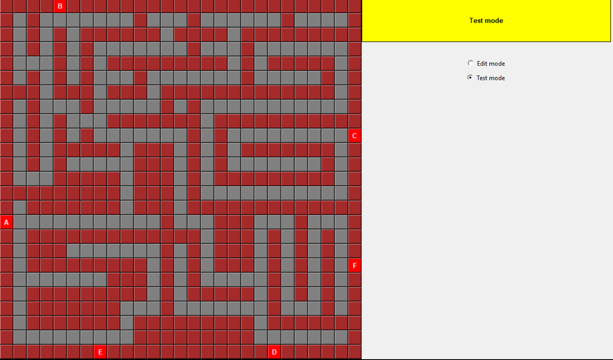

<h2>Анализ лабиринта</h2>

&nbsp;&nbsp;&nbsp;&nbsp;Программный модуль, написанный на языке Python производит анализ лабиринта и поиск кратчайшего пути от выбранной точки до одного из выбранных заданных выходов.

&nbsp;&nbsp;&nbsp;&nbsp;Данная программа является расширенной версией практического задания 22, но с графическим интерфейсом на Tkinter. В программе также использован модуль pf() из моего практического задания 22.

&nbsp;&nbsp;&nbsp;&nbsp;Программа позволяет выбрать стартовую позицию, обрабатывает ошибочный выбор позиции (например в стене) и при каждом удачном выборе рассчитывает и отображает (маркирует зеленым цветом на карте и выводит список в статус-окне) все доступные из этой точки выходы.

&nbsp;&nbsp;&nbsp;&nbsp; После того, как стратовая позиция выбрана, можно кликнуть на любой выход. При этом, если выход - "зеленый" то будет построен кратчайший путь к нему. В случае, если выход - недоступен, то в статус окне бвыводится соответствующее сообщение.

&nbsp;&nbsp;&nbsp;&nbsp;Опция "Edit mode" пока - недоступна и находится в разработке. По мере возможности будет доделана возможность редактирования лабиринта. Также в планах доделка возможности загружать разные лабиринты и создавать и сохранять новые.

Рис 1. Начальный экран.

Рис 2. Выбор стартовой позиции.  Расчёт доступных выходов. 

Рис 3. Просчёт и отрисовка кратчайшего пути  до выбранного выхода. 

Рис 4. Старт в замкнутой области.  Выхода нет.

